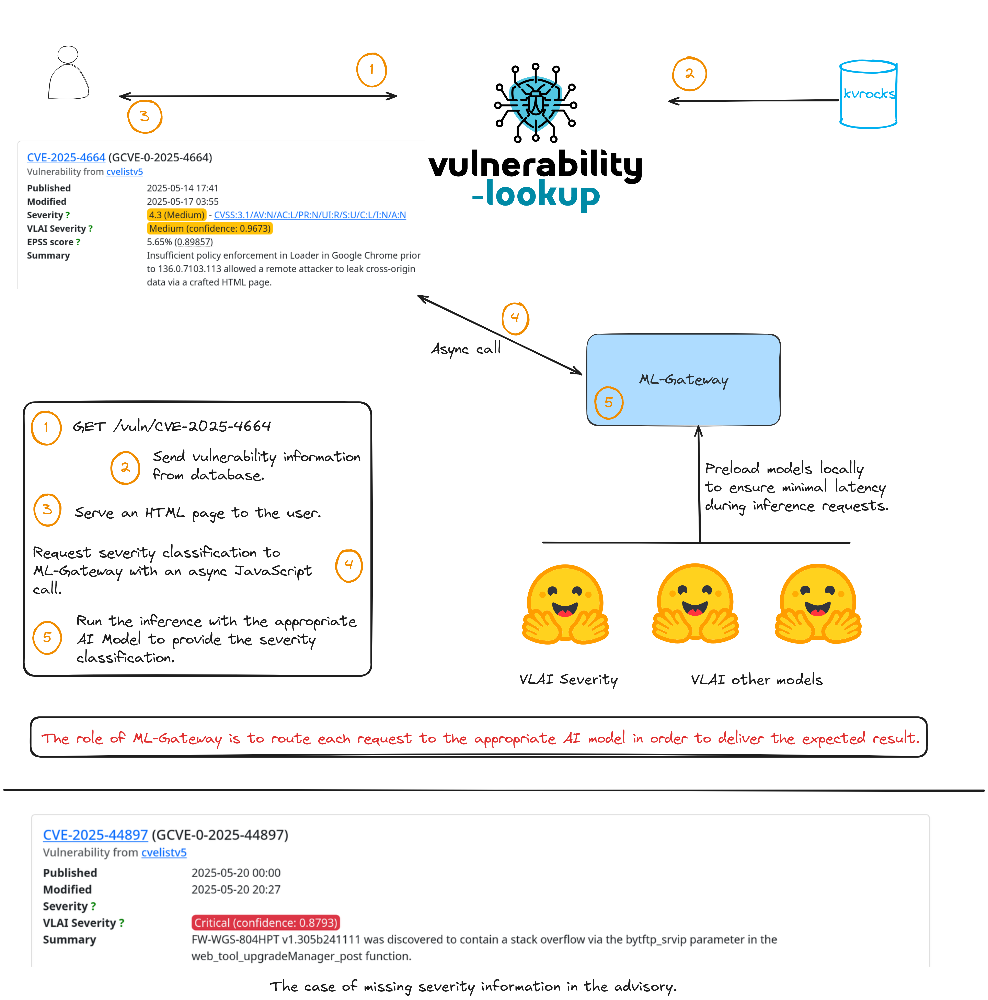

# ML-Gateway

This project implements a FastAPI-based local server designed to load one or
more pre-trained NLP models during startup and expose them through a clean,
RESTful API for inference.

For example, it leverages the Hugging Face transformers library to load the
[CIRCL/vulnerability-severity-classification-RoBERTa-base](https://huggingface.co/CIRCL/vulnerability-severity-classification-roberta-base),
which specializes in classifying vulnerability descriptions according to their severity level.
The server initializes this model once at startup, ensuring minimal latency during inference requests.

Clients interact with the server via dedicated HTTP endpoints corresponding to each loaded model.
Additionally, the server automatically generates comprehensive OpenAPI documentation that details
the available endpoints, their expected input formats, and sample responses—making it easy to
explore and integrate the services.

The ultimate goal is to enrich vulnerability data descriptions through the application of a suite
of NLP models, providing direct benefits to Vulnerability-Lookup and supporting other related projects.

[](docs/ml-gateway.png)

## Installation

```bash
git clone https://github.com/vulnerability-lookup/ML-Gateway
cd ML-Gateway/
poetry install
```


## Running the server

```bash
poetry run uvicorn api.main:app --host 0.0.0.0 --port 8000
```

Deployment is straightforward—no configuration files or databases are required.
Inference with the pre-trained models runs efficiently without the need for a GPU.

We recommend running ML-Gateway on a separate server than Vulnerability-Lookup.


## API Endpoint

### Examples

```bash
curl -X 'POST' \
  'http://127.0.0.1:8000/classify/severity' \
  -H 'accept: application/json' \
  -H 'Content-Type: application/json' \
  -d '{
  "description": "SAP NetWeaver Visual Composer Metadata Uploader is not protected with a proper authorization, allowing unauthenticated agent to upload potentially malicious executable binaries that could severely harm the host system. This could significantly affect the confidentiality, integrity, and availability of the targeted system."
}'
{"severity":"Critical","confidence":0.9862}
```

For classifying severity the default model involved is
[CIRCL/vulnerability-severity-classification-RoBERTa-base](https://huggingface.co/CIRCL/vulnerability-severity-classification-roberta-base). But you can specify another:

```bash
curl -X 'POST' \
  'http://127.0.0.1:8000/classify/severity' \
  -H 'accept: application/json' \
  -H 'Content-Type: application/json' \
  -d '{
  "description": "SAP NetWeaver Visual Composer Metadata Uploader is not protected with a proper authorization, allowing unauthenticated agent to upload potentially malicious executable binaries that could severely harm the host system. This could significantly affect the confidentiality, integrity, and availability of the targeted system.",
  "model": "CIRCL/vulnerability-severity-classification-distilbert-base-uncased"
}'
{"severity":"Critical","confidence":0.7022}
```

If you need to use the model pre-trained for Chinese language:

```bash
curl -X 'POST'   'http://127.0.0.1:8000/classify/severity'   -H 'accept: application/json'   -H 'Content-Type: application/json'   -d '{
  "description": "TOTOLINK A3600R是中国吉翁电子（TOTOLINK）公司的一款6天线1200M无线路由器。TOTOLINK A3600R存在缓冲区溢出漏洞，该漏洞源于/cgi-bin/cstecgi.cgi文件的UploadCustomModule函数中的File参数未能正确验证输入数据的长度大小，攻击者可利用该漏洞在系统上执行任意代码或者导致拒绝服务。",
  "model": "CIRCL/vulnerability-severity-classification-chinese-macbert-base"
}'
{"severity":"高","confidence":0.9802}
```


### Integration with Vulnerability-Lookup

The HTML frontend templates of Vulnerability-Lookup use asynchronous JavaScript
calls to interact with
[a dedicated API endpoint](https://www.vulnerability-lookup.org/documentation/api-v1.html#post--vlai-severity-classification):


```javascript
fetch("https://vulnerability.circl.lu/api/vlai/severity-classification", {
    method: "POST",
    headers: {
    "Content-Type": "application/json"
    },
    body: JSON.stringify({ description: "Description of the vulnerability…" })
})
.then(response => response.json())
.then(result => {
    console.log(result["severity"] + " (confidence: " + result["confidence"] + ")");
})
.catch((error) => {
    console.error("Error:", error);
});
```

When a request is received, the Vulnerability-Lookup backend forwards it to the ML-Gateway API.
The ML-Gateway performs the inference, and the resulting severity classification,
along with a confidence score,is returned and displayed to the user.


## Refreshing the models

```bash
poetry run ml-gw-cli refresh-all
```


## Funding

[AIPITCH](https://www.linkedin.com/company/aipitch)
(AI-Powered Innovative Toolkit for Cybersecurity Hubs) is a co-funded EU project
supported by the European Cybersecurity Competence Centre (ECCC) under the
DIGITAL-ECCC-2024-DEPLOY-CYBER-06-ENABLINGTECH program and
[CIRCL](https://www.circl.lu).

The project brings together an international consortium to develop AI-based tools
that enhance the capabilities of operational cybersecurity teams.
These tools are designed to support critical services, with a focus on national
security teams, while also being applicable to internal security teams in
companies and institutions.


## License

[ML-Gateway](https://github.com/vulnerability-lookup/ML-Gateway) is licensed under
[GNU Affero General Public License version 3](https://www.gnu.org/licenses/agpl-3.0.html).

~~~
Copyright (c) 2025 Computer Incident Response Center Luxembourg (CIRCL)
Copyright (C) 2025 Cédric Bonhomme - https://github.com/cedricbonhomme
~~~

