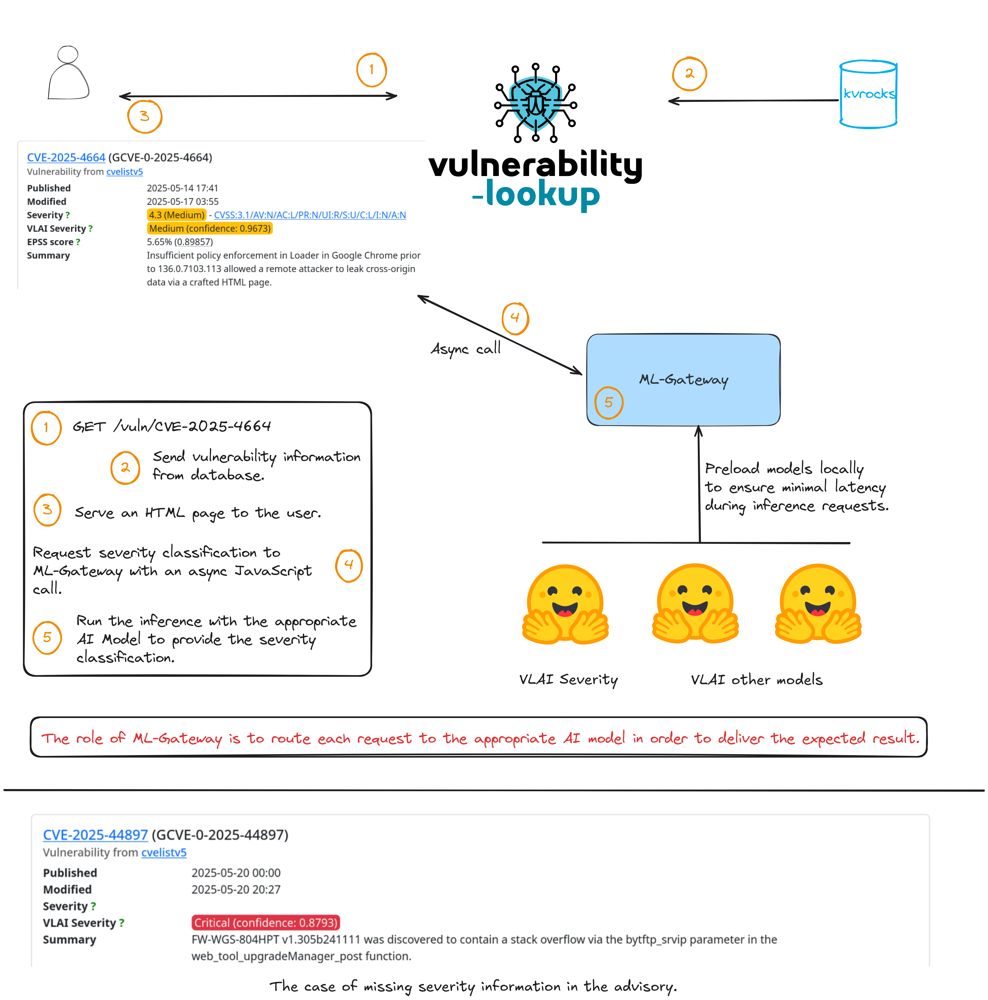
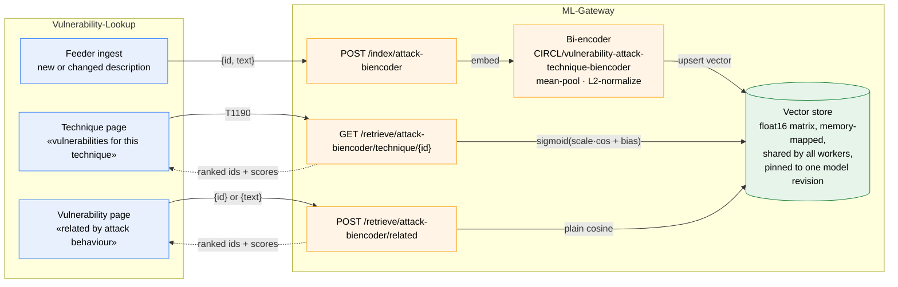
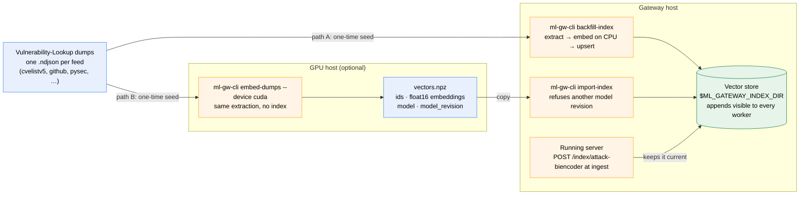

# ML-Gateway

This project implements a FastAPI-based local server designed to load one or
more pre-trained NLP models during startup and expose them through a clean,
RESTful API for inference.

For example, it leverages the Hugging Face transformers library to load the
[CIRCL/vulnerability-severity-classification-RoBERTa-base](https://huggingface.co/CIRCL/vulnerability-severity-classification-roberta-base),
which specializes in classifying vulnerability descriptions according to their severity level.
The server initializes this model once at startup, ensuring minimal latency during inference requests.

Clients interact with the server via dedicated HTTP endpoints corresponding to each loaded model.
Additionally, the server automatically generates comprehensive OpenAPI documentation that details
the available endpoints, their expected input formats, and sample responses—making it easy to
explore and integrate the services.

The ultimate goal is to enrich vulnerability data descriptions through the application of a suite
of NLP models, providing direct benefits to Vulnerability-Lookup and supporting other related projects.

[](docs/ml-gateway.png)

## Installation

```bash
git clone https://github.com/vulnerability-lookup/ML-Gateway
cd ML-Gateway/
poetry install
```


## Running the server

For production on a 16-core machine, we recommend gunicorn with uvicorn workers
and gunicorn's `--preload` flag:

```bash
HF_HUB_OFFLINE=1 OMP_NUM_THREADS=4 MKL_NUM_THREADS=4 \
ML_GATEWAY_INDEX_TOKEN='<shared secret>' \
poetry run gunicorn api.main:app \
  -k uvicorn.workers.UvicornWorker \
  -w 4 --preload \
  -b 127.0.0.1:8000 \
  --graceful-timeout 2 --timeout 300 \
  --reuse-port --proxy-protocol
```

Bind the gateway to localhost or a private interface that only
Vulnerability-Lookup can reach, never to a public address: the read endpoints
are unauthenticated and run CPU-bound inference for every call, so anyone who
can reach them can saturate the server, and the index endpoint, although it
requires a token, writes to disk.

Why these settings on 16 cores:

- `--preload` imports the app (and therefore loads every model) once in the
  master process before forking. Workers inherit the loaded weights via
  copy-on-write, so the models are held in memory once instead of once per
  worker.
- `-w 4` with `OMP_NUM_THREADS=4` / `MKL_NUM_THREADS=4` gives each worker 4
  PyTorch intra-op threads. 4 × 4 = 16 keeps every core busy during inference
  while avoiding the memory overhead of 8+ worker processes.
- `--reuse-port` lets the kernel spread incoming connections across workers;
  `--proxy-protocol` preserves client IPs when fronted by a PROXY-protocol
  aware load balancer.
- `ML_GATEWAY_INDEX_TOKEN` is the shared secret the index endpoint requires
  (see the environment table below).
- `HF_HUB_OFFLINE=1` forbids any Hugging Face Hub access, so the server never
  pulls model updates behind your back. Every model the server preloads must
  already be in the local cache, or startup fails with
  `LocalEntryNotFoundError`. Run `poetry run ml-gw-cli refresh-all` once
  after installing and **after every upgrade that adds a model**, then start
  the server.

For development, a single uvicorn process is sufficient:

```bash
ML_GATEWAY_INDEX_TOKEN=dev poetry run uvicorn api.main:app --host 127.0.0.1 --port 8000
```

### Environment variables

| Variable | Default | Purpose |
|---|---|---|
| `ML_GATEWAY_INDEX_TOKEN` | unset | Shared secret for `POST /index/attack-biencoder`, sent by the client as `Authorization: Bearer <token>`. While unset the endpoint refuses every call with `503`; a wrong or missing token gets `401`. The read endpoints never require it. Give the same value to Vulnerability-Lookup as `ML_GATEWAY_TOKEN`. |
| `ML_GATEWAY_INDEX_MAX_ITEMS` | `5000000` | Ceiling on the number of distinct IDs the index endpoint may grow the index to (about 1.5 KB each). A call that would exceed it is refused with `507`; updating an already indexed ID is always allowed. The CLI commands are not subject to it. |
| `ML_GATEWAY_INDEX_DIR` | `./index` | Directory of the on-disk vector index, one sub-directory per model. Must be the same for the server and the CLI. |
| `HF_HUB_OFFLINE` | unset | Set to `1` to forbid Hugging Face Hub access; every model must then be cached first with `ml-gw-cli refresh-all`. |

Deployment is straightforward—no configuration files or databases are required.
Inference with the pre-trained models runs efficiently without the need for a GPU.

We recommend running ML-Gateway on a separate server than Vulnerability-Lookup.


## API Endpoint

### Examples

```bash
curl -X 'POST' \
  'http://127.0.0.1:8000/classify/severity' \
  -H 'accept: application/json' \
  -H 'Content-Type: application/json' \
  -d '{
  "description": "SAP NetWeaver Visual Composer Metadata Uploader is not protected with a proper authorization, allowing unauthenticated agent to upload potentially malicious executable binaries that could severely harm the host system. This could significantly affect the confidentiality, integrity, and availability of the targeted system."
}'
{"severity":"Critical","confidence":0.9862,"model":"CIRCL/vulnerability-severity-classification-RoBERTa-base","model_revision":"93b8afccb438608a51c33983a0fafaedd0730f11"}
```

For classifying severity the default model involved is
[CIRCL/vulnerability-severity-classification-RoBERTa-base](https://huggingface.co/CIRCL/vulnerability-severity-classification-roberta-base). But you can specify another:

```bash
curl -X 'POST' \
  'http://127.0.0.1:8000/classify/severity' \
  -H 'accept: application/json' \
  -H 'Content-Type: application/json' \
  -d '{
  "description": "SAP NetWeaver Visual Composer Metadata Uploader is not protected with a proper authorization, allowing unauthenticated agent to upload potentially malicious executable binaries that could severely harm the host system. This could significantly affect the confidentiality, integrity, and availability of the targeted system.",
  "model": "CIRCL/vulnerability-severity-classification-distilbert-base-uncased"
}'
{"severity":"Critical","confidence":0.7022,"model":"CIRCL/vulnerability-severity-classification-distilbert-base-uncased","model_revision":"<commit-sha>"}
```

If you need to use the model pre-trained for Chinese language:

```bash
curl -X 'POST'   'http://127.0.0.1:8000/classify/severity'   -H 'accept: application/json'   -H 'Content-Type: application/json'   -d '{
  "description": "TOTOLINK A3600R是中国吉翁电子（TOTOLINK）公司的一款6天线1200M无线路由器。TOTOLINK A3600R存在缓冲区溢出漏洞，该漏洞源于/cgi-bin/cstecgi.cgi文件的UploadCustomModule函数中的File参数未能正确验证输入数据的长度大小，攻击者可利用该漏洞在系统上执行任意代码或者导致拒绝服务。",
  "model": "CIRCL/vulnerability-severity-classification-chinese-macbert-base"
}'
{"severity":"高","confidence":0.9802,"model":"CIRCL/vulnerability-severity-classification-chinese-macbert-base","model_revision":"<commit-sha>"}
```


### ATT&CK technique classification

`POST /classify/attack-techniques` ranks MITRE ATT&CK (Enterprise) techniques
for a vulnerability description with
[CIRCL/vulnerability-attack-technique-classification-roberta-base](https://huggingface.co/CIRCL/vulnerability-attack-technique-classification-roberta-base).
Unlike severity classification this is a *multi-label* task: every technique
in the model's vocabulary is scored independently (sigmoid), so the scores do
not sum to 1 and several techniques can clear the 0.5 prediction threshold at
once. The `top_k` field (default 10) controls how many ranked techniques are
returned; the full ranking is computed and cached once per description, so
varying `top_k` does not re-run inference.

```bash
curl -X 'POST' \
  'http://127.0.0.1:8000/classify/attack-techniques' \
  -H 'accept: application/json' \
  -H 'Content-Type: application/json' \
  -d '{
  "description": "Zoho ManageEngine ServiceDesk Plus before 11306 is vulnerable to unauthenticated remote code execution.",
  "top_k": 3
}'
{"techniques":[{"technique":"T1190","name":"Exploit Public-Facing Application","score":0.7147,"predicted":true},{"technique":"T1059","name":"Command and Scripting Interpreter","score":0.7063,"predicted":true},{"technique":"T1505","name":"Server Software Component","score":0.6834,"predicted":true}],"model":"CIRCL/vulnerability-attack-technique-classification-roberta-base","model_revision":"3b98a1d962b5c35c5dc82ac188f8d2a9aae63eda"}
```

Response fields:

| Field | Type | Description |
|---|---|---|
| `techniques` | `array` | Top-k techniques ranked by score, best first. Empty when classification failed. |
| `techniques[].technique` | `string` | MITRE ATT&CK technique ID (e.g. `T1190`). |
| `techniques[].name` | `string \| null` | Official ATT&CK technique name, from the bundled ATT&CK name table. |
| `techniques[].score` | `float` | Sigmoid probability, rounded to four decimals. |
| `techniques[].predicted` | `bool` | `true` when the score is at least 0.5, the threshold used by the model's training metrics. |
| `model` / `model_revision` / `error` | | Same provenance and error semantics as `/classify/severity`. |


### ATT&CK retrieval with the bi-encoder

[CIRCL/vulnerability-attack-technique-biencoder](https://huggingface.co/CIRCL/vulnerability-attack-technique-biencoder)
embeds vulnerability descriptions and ATT&CK technique texts in one vector
space, which answers two questions the classification head cannot: *which
vulnerabilities for this technique* and *which vulnerabilities behave like
this one*. The gateway owns the vectors and the search; clients such as
Vulnerability-Lookup only send descriptions and render the answers. Only the
vulnerability → technique direction has measured accuracy, so present both
searches as similarity aids, not classifications.


```mermaid
flowchart LR
    classDef data fill:#e8f0fe,stroke:#4285f4,color:#000;
    classDef tool fill:#fff4e5,stroke:#f9a825,color:#000;
    classDef out fill:#e6f4ea,stroke:#188038,color:#000;

    subgraph VL["Vulnerability-Lookup"]
        direction TB
        ingest["Feeder ingest<br/>new or changed description"]:::data
        techpage["Technique page<br/>«vulnerabilities for this technique»"]:::data
        vulnpage["Vulnerability page<br/>«related by attack behaviour»"]:::data
    end

    subgraph GW["ML-Gateway"]
        direction TB
        idx["POST /index/attack-biencoder"]:::tool
        tech["GET /retrieve/attack-biencoder/technique/{id}"]:::tool
        rel["POST /retrieve/attack-biencoder/related"]:::tool
        enc["Bi-encoder<br/>CIRCL/vulnerability-attack-technique-biencoder<br/>mean-pool · L2-normalize"]:::tool
        store[("Vector store<br/>float16 matrix, memory-mapped,<br/>shared by all workers,<br/>pinned to one model revision")]:::out
    end

    ingest -- "{id, text}" --> idx
    techpage -- "T1190" --> tech
    vulnpage -- "{id} or {text}" --> rel
    idx -- embed --> enc
    enc -- upsert vector --> store
    tech -- "sigmoid(scale·cos + bias)" --> store
    rel -- "plain cosine" --> store
    tech -. "ranked ids + scores" .-> techpage
    rel -. "ranked ids + scores" .-> vulnpage
```

The index lives on disk under `ML_GATEWAY_INDEX_DIR` (default `./index`, one
sub-directory per model). It must be a persistent volume shared by every
worker process: the float16 matrix is memory-mapped, so gunicorn workers share
one copy through the page cache and see each other's appends. Vectors are only
comparable within one model revision; the directory records the revision it
was built with, and every request returns an `error` asking for a rebuild when
the served model changes (delete the directory and index the corpus again).

Index one or more descriptions (call once per record at ingest, and again
whenever a description changes — re-sending an ID replaces its vector). This
is the only endpoint that writes, so it requires the bearer token configured
as `ML_GATEWAY_INDEX_TOKEN` and refuses calls past `ML_GATEWAY_INDEX_MAX_ITEMS`
with `507`:

```bash
curl -X 'POST' 'http://127.0.0.1:8000/index/attack-biencoder' \
  -H 'Authorization: Bearer <ML_GATEWAY_INDEX_TOKEN>' \
  -H 'Content-Type: application/json' \
  -d '{"items": [{"id": "CVE-2021-44077", "text": "Zoho ManageEngine ServiceDesk Plus before 11306 is vulnerable to unauthenticated remote code execution."}]}'
{"indexed":1,"count":1,"model":"CIRCL/vulnerability-attack-technique-biencoder","model_revision":"fb2219fa308ef9b967374267363f9b834a775b17","error":null}
```

List the techniques the technique search can rank for (the trained vocabulary
plus every other enterprise technique with a bundled ATT&CK text), so a client
can offer a technique index without its own copy of the ATT&CK tables:

```bash
curl 'http://127.0.0.1:8000/retrieve/attack-biencoder/techniques'
{"techniques":[{"technique":"T1001","name":"Data Obfuscation","in_vocabulary":false},…,{"technique":"T1190","name":"Exploit Public-Facing Application","in_vocabulary":true},…],"model":"CIRCL/vulnerability-attack-technique-biencoder","model_revision":"fb2219fa308ef9b967374267363f9b834a775b17","error":null}
```

Rank indexed vulnerabilities for a technique. Scores are the training-time
probability `sigmoid(logit_scale · cosine + logit_bias)`, so a vulnerability's
score for a technique here equals what the vulnerability → technique direction
gives it. Techniques the model was not trained on are embedded from their
official ATT&CK text and reported with `in_vocabulary: false`; they rank
noticeably worse and interfaces should flag them.

```bash
curl 'http://127.0.0.1:8000/retrieve/attack-biencoder/technique/T1190?top_k=3'
{"technique":"T1190","name":"Exploit Public-Facing Application","in_vocabulary":true,"results":[{"id":"CVE-2021-44077","score":0.7556}],"model":"CIRCL/vulnerability-attack-technique-biencoder","model_revision":"fb2219fa308ef9b967374267363f9b834a775b17","error":null}
```

Find the vulnerabilities nearest to one vulnerability, by plain cosine. Pass
either the `id` of an indexed vulnerability (excluded from its own results) or
a free `text`:

```bash
curl -X 'POST' 'http://127.0.0.1:8000/retrieve/attack-biencoder/related' \
  -H 'Content-Type: application/json' \
  -d '{"id": "CVE-2021-44077", "top_k": 3}'
{"results":[{"id":"CVE-2017-0144","score":0.3841}],"model":"CIRCL/vulnerability-attack-technique-biencoder","model_revision":"fb2219fa308ef9b967374267363f9b834a775b17","error":null}
```

| Endpoint | Field | Description |
|---|---|---|
| `POST /index/attack-biencoder` | `Authorization` | `Bearer <ML_GATEWAY_INDEX_TOKEN>`; `401` if wrong, `503` while the gateway has no token configured. |
| | `items[].id`, `items[].text` | Identifier (no whitespace) and description to embed; up to 1000 items per call. |
| | `indexed`, `count` | Items upserted by this call; distinct IDs in the index afterwards. |
| `GET /retrieve/attack-biencoder/techniques` | `model` | Query parameter. |
| | `techniques[]` | `technique`, `name`, `in_vocabulary` for every technique the technique search can rank for, sorted by ID. |
| `GET /retrieve/attack-biencoder/technique/{id}` | `top_k`, `model` | Query parameters; `top_k` defaults to 10 (max 1000). |
| | `in_vocabulary` | `true` for the 53 techniques the model was trained on. |
| | `results[].score` | `sigmoid(logit_scale · cosine + logit_bias)`, rounded to four decimals. |
| `POST /retrieve/attack-biencoder/related` | `id` *or* `text` | Exactly one; plus optional `top_k` and `model`. |
| | `results[].score` | Plain cosine, rounded to four decimals. |
| all | `model` / `model_revision` / `error` | Same provenance and error semantics as `/classify/severity`. |

#### Filling the index

Vulnerability-Lookup sends every new or updated description to the index
endpoint at ingest, so the index only has to be seeded once with the existing
corpus. That seed is read from the NDJSON dumps Vulnerability-Lookup publishes
and can be embedded either on the gateway host or on a faster GPU host.


```mermaid
flowchart LR
    classDef data fill:#e8f0fe,stroke:#4285f4,color:#000;
    classDef tool fill:#fff4e5,stroke:#f9a825,color:#000;
    classDef out fill:#e6f4ea,stroke:#188038,color:#000;

    dumps["Vulnerability-Lookup dumps<br/>one .ndjson per feed<br/>(cvelistv5, github, pysec, …)"]:::data

    subgraph gpu["GPU host (optional)"]
        direction LR
        embed["ml-gw-cli embed-dumps --device cuda<br/>same extraction, no index"]:::tool
        npz["vectors.npz<br/>ids · float16 embeddings<br/>model · model_revision"]:::data
    end

    subgraph gateway["Gateway host"]
        direction TB
        backfill["ml-gw-cli backfill-index<br/>extract → embed on CPU → upsert"]:::tool
        imp["ml-gw-cli import-index<br/>refuses another model revision"]:::tool
        server["Running server<br/>POST /index/attack-biencoder at ingest"]:::tool
        store[("Vector store<br/>$ML_GATEWAY_INDEX_DIR<br/>appends visible to every worker")]:::out
    end

    dumps -- "path A: one-time seed" --> backfill --> store
    dumps -- "path B: one-time seed" --> embed --> npz -- copy --> imp --> store
    server -- "keeps it current" --> store
```

**1. Download the dumps.** A Vulnerability-Lookup instance publishes one plain
`.ndjson` file per feed, regenerated daily, for example at
<https://vulnerability.circl.lu/dumps/>. There is no archive to unpack: fetch
the feeds you want into one directory. `cvelistv5.ndjson` alone is several GB.

```bash
mkdir -p /var/lib/ml-gateway/dumps && cd /var/lib/ml-gateway/dumps
for feed in cvelistv5 github pysec jvndb; do
  curl -fLO --retry 3 "https://vulnerability.circl.lu/dumps/${feed}.ndjson"
done
```

Which feeds to take:

- `cvelistv5` is the CVE corpus. Leave `nvd` and `fkie_nvd` out of the first
  pass: they carry the same CVEs, so almost every record would be a duplicate
  that is read and discarded. Add them later with `--skip-existing` to pick
  up the few CVEs that `cvelistv5` lacks.
- `github`, `pysec`, `jvndb` and `variot` add non-CVE advisories.
- The `csaf_*` feeds are large and their summaries are advisory topics rather
  than vulnerability descriptions; add them only if you want advisories to
  show up in the related-vulnerabilities search.
- `comments`, `bundles`, `sightings` and `kev_entries` are not vulnerability
  feeds and are skipped automatically if they sit in the directory.
- Files may be gzipped (`.ndjson.gz`) to save disk space.

**2a. Embed on the gateway host.** `backfill-index` reads the dumps,
recognizes the CVE JSON 5, NVD API, OSV, CSAF, JVNDB and VARIoT layouts,
indexes each ID once (first occurrence wins; a directory is read in sorted
order, so `cvelistv5` precedes `fkie_nvd` and `nvd`) and prints a per-feed
report. It is safe to run while the server is up. Expect a few hours for
several hundred thousand descriptions on a multi-core server CPU, so run it
under `tmux` or `nohup`; `--skip-existing` resumes an interrupted run and
`--limit` is handy for a first try.

```bash
HF_HUB_OFFLINE=1 ML_GATEWAY_INDEX_DIR=/var/lib/ml-gateway/index \
  poetry run ml-gw-cli backfill-index --dumps /var/lib/ml-gateway/dumps/ --batch-size 64
```

**2b. Or embed on a GPU host and ship the vectors.** `embed-dumps` runs the
same extraction and deduplication without touching any index, and writes one
`.npz` archive (`ids`, float16 `embeddings`, `model`, `model_revision`; about
1.5 KB per vulnerability). Clone this repository on the GPU host, install it,
cache the model, then embed:

```bash
git clone https://github.com/vulnerability-lookup/ML-Gateway && cd ML-Gateway
poetry install
poetry run ml-gw-cli refresh-model --model-name CIRCL/vulnerability-attack-technique-biencoder
poetry run ml-gw-cli embed-dumps --dumps /path/to/dumps/ --output vectors.npz --device cuda
```

Copy `vectors.npz` to the gateway host and import it. The import refuses an
archive whose model revision differs from the served model, so both hosts must
have the same revision cached: refresh the model on both on the same day. The
archive can also be produced with the reference snippet from VulnTrain's
`attack-biencoder-retrieval` page, as long as it carries the keys above and
the vectors are L2-normalized.

```bash
HF_HUB_OFFLINE=1 ML_GATEWAY_INDEX_DIR=/var/lib/ml-gateway/index \
  poetry run ml-gw-cli import-index --file vectors.npz
```

**3. Rebuilding.** Vectors are only comparable within one model revision.
When the served model changes, delete the index directory and seed it again
with either path.

### Integration with Vulnerability-Lookup

The HTML frontend templates of Vulnerability-Lookup use asynchronous JavaScript
calls to interact with
[a dedicated API endpoint](https://www.vulnerability-lookup.org/documentation/api-v1.html#post--vlai-severity-classification):


```javascript
fetch("https://vulnerability.circl.lu/api/vlai/severity-classification", {
    method: "POST",
    headers: {
    "Content-Type": "application/json"
    },
    body: JSON.stringify({ description: "Description of the vulnerability…" })
})
.then(response => response.json())
.then(result => {
    console.log(result["severity"] + " (confidence: " + result["confidence"] + ")");
})
.catch((error) => {
    console.error("Error:", error);
});
```

When a request is received, the Vulnerability-Lookup backend forwards it to the ML-Gateway API.
The ML-Gateway performs the inference, and the resulting severity classification,
along with a confidence score, is returned and displayed to the user.

### Response fields

| Field | Type | Description |
|---|---|---|
| `severity` | `string \| null` | Predicted severity label (e.g. `Low`, `Medium`, `High`, `Critical`). `null` when classification could not be performed. |
| `confidence` | `float` | Softmax probability of the predicted class, rounded to four decimals. |
| `model` | `string` | Hugging Face model identifier that produced the prediction. |
| `model_revision` | `string \| null` | Commit SHA of the model snapshot loaded from the Hugging Face Hub. `null` when the snapshot does not carry revision metadata (e.g. a local path). Useful to pin and audit the exact weights that produced a result. |
| `error` | `string` | Present only when classification failed; carries a human-readable message. |


## Refreshing the models

```bash
poetry run ml-gw-cli refresh-all
```


## Funding

[AIPITCH](https://www.linkedin.com/company/aipitch)
(AI-Powered Innovative Toolkit for Cybersecurity Hubs) is a co-funded EU project
supported by the European Cybersecurity Competence Centre (ECCC) under the
DIGITAL-ECCC-2024-DEPLOY-CYBER-06-ENABLINGTECH program and
[CIRCL](https://www.circl.lu).

The project brings together an international consortium to develop AI-based tools
that enhance the capabilities of operational cybersecurity teams.
These tools are designed to support critical services, with a focus on national
security teams, while also being applicable to internal security teams in
companies and institutions.


## License

[ML-Gateway](https://github.com/vulnerability-lookup/ML-Gateway) is licensed under
[GNU Affero General Public License version 3](https://www.gnu.org/licenses/agpl-3.0.html).

~~~
Copyright (c) 2025-2026 Computer Incident Response Center Luxembourg (CIRCL)
Copyright (C) 2025-2026 Cédric Bonhomme - https://github.com/cedricbonhomme
~~~

